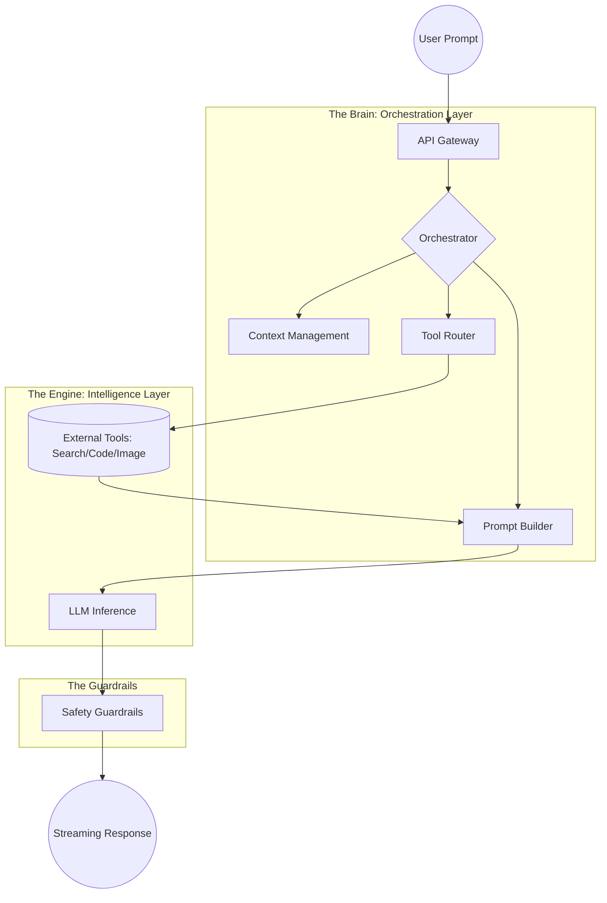

# ChatGPT System Design: Beyond the LLM 🧠

This repository breaks down the high-level architecture of ChatGPT. The core takeaway?  
ChatGPT is not just an AI model; it is a complex production system built around a model.

This is Day 1 of my series: **"30 Days of AI Systems."**

---

## 🧠 The Big Idea

Most people think ChatGPT is just a chat box connected to a model. In reality, an LLM (Large Language Model) is **stateless** and **frozen**.  

To make it useful for millions of users, you need a layered system to handle:
- Scale  
- Memory  
- Tools  
- Safety  

**Mental Model:**  
If the LLM is the engine, the System Design is the car. You can't drive an engine alone.

---

## ⚡ High-Level Architecture

In a production environment, the request travels through several specialized layers before a single word is generated.



---

## 🧩 Key System Components

### 1. API & Entry Layer
Acts as the gatekeeper. It handles:
- Authentication  
- Rate Limiting (to prevent API abuse)  
- Request Routing  

Ensures the system knows:
- Who is asking  
- What permissions they have (e.g., GPT-4o vs GPT-3.5)

---

### 2. The Orchestration Layer (The "Nerd" Hook) 💡

The most critical part of modern AI. It acts as the central coordinator:

- **Manages State:** Decides which parts of your history are relevant  
- **Tool Router:** Determines if it needs to exit the model to use a tool  
- **Prompt Assembly:** Combines input + system instructions + retrieved context  

---

### 3. Context Management

LLMs have a **context window** (limited memory per request).  

This layer:
- Retrieves past conversation history  
- Injects relevant context into the prompt  
- Enables multi-turn conversations  

---

### 4. LLM Inference Layer

The heavy lifting layer:
- Runs on GPU/TPU clusters  
- Processes text as tokens  
- Generates output token-by-token using optimized inference engines  

---

### 5. Tool Integration (RAG & Actions)

Since LLMs are frozen at their training cutoff, they rely on tools:

- **Web Search** → current events  
- **Code Interpreter** → math, data analysis  
- **DALL·E** → image generation  

---

### 6. Safety & Guardrails

A two-way filtering system:

- **Input filtering:** Detects malicious prompts (jailbreaks)  
- **Output filtering:** Prevents harmful content, PII leaks, hallucinations  

---

## 🔁 The End-to-End Flow

1. **Input:**  
   User asks: *"What's the stock price of Apple?"*

2. **Orchestration:**  
   System detects missing real-time data → triggers tool usage  

3. **Tools:**  
   Search fetches live price → `$190.50`

4. **Prompt Construction:**  
   ```
   System: You are an assistant  
   Context: The price is $190.50  
   User: What's the price?
   ```

5. **Inference:**  
   LLM generates:  
   *"Apple is currently trading at $190.50."*

6. **Guardrails:**  
   Response is safety-checked  

7. **Streaming:**  
   Tokens are streamed back to the UI in real-time  

---

## 📌 The Golden Rule for AI Devs

```
Product = Orchestration + Context + Tools + LLM
```

👉 The LLM is a commodity  
👉 The orchestration is where real value is built  

---

## 🎥 About the Series

This repo is part of **"30 Days of AI Systems"** by @thehalfstackgirl.  

Breaking down how real-world AI systems work under the hood.

- Follow the journey on Instagram  
- Read the full article  
